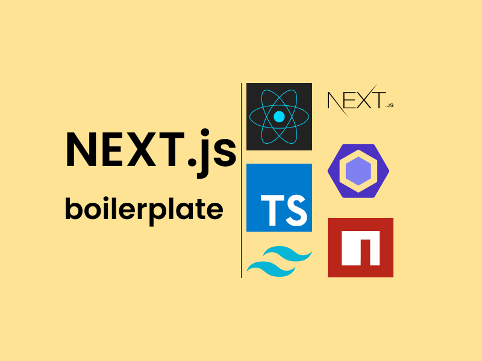

# Next.js boilerplate with integrated Tailwind CSS and configured ES lint

<p align="center">
  <a href="https://next-tailwind-boilerplate.vercel.app"></a>
</p>

Use this project as a starting point to create your own. You can check the [demo here](https://next-tailwind-boilerplate.vercel.app).
This project is also SEO friendly. So it will help you with it.

Run the following command on your machine:

```
git clone --depth=1 https://github.com/rinatgumarov/next-tailwind-boilerplate.git my-project-name
code my-project-name
```

### Features

- 🛠 [Next.js](https://nextjs.org) With configured es-linter in development mode
- 🌎 [TypeScript](https://www.typescriptlang.org)
- 🎀 [Tailwind CSS](https://tailwindcss.com)
- ✅ [ESLint](https://eslint.org) - typescript, react, next.js, jsx-a11y, security
- 🎹 [Prettier](https://prettier.io)
- 👨‍💼 [Next SEO](https://github.com/garmeeh/next-seo)
- 🇯🇵 [Next-i18next](https://github.com/isaachinman/next-i18next) configured with Typescript support

### Run it locally

```
npm run dev
```

Open http://localhost:3000 with your favorite browser to see your project.

### Edit

Change the following:

- icons and manifest in `public/` - I suggest you to use [https://realfavicongenerator.net/](https://realfavicongenerator.net/)
- fonts in `src/pades/_document_.tsx:8`and in tailwind config `tailwind.config.js`
- deafaul seo props in `src/utils/seo.ts`
- robots.txt in `src/pages/robots.txt.tsx`

### Recommended VS Code Extensions

- dbaeumer.vscode-eslint
- eamodio.gitlens
- christian-kohler.npm-intellisense
- christian-kohler.path-intellisense
- esbenp.prettier-vscode
- mikestead.dotenv
- bradlc.vscode-tailwindcss

## Learn More

To learn more about Next.js, take a look at the following resources:

- [Next.js Documentation](https://nextjs.org/docs) - learn about Next.js features and API.
- [Learn Next.js](https://nextjs.org/learn) - an interactive Next.js tutorial.

You can check out [the Next.js GitHub repository](https://github.com/vercel/next.js/)

## Deploy on Vercel

The easiest way to deploy your Next.js app is to use the [Vercel Platform](https://vercel.com/new?utm_medium=default-template&filter=next.js&utm_source=create-next-app&utm_campaign=create-next-app-readme) from the creators of Next.js.

Check out our [Next.js deployment documentation](https://nextjs.org/docs/deployment) for more details.
